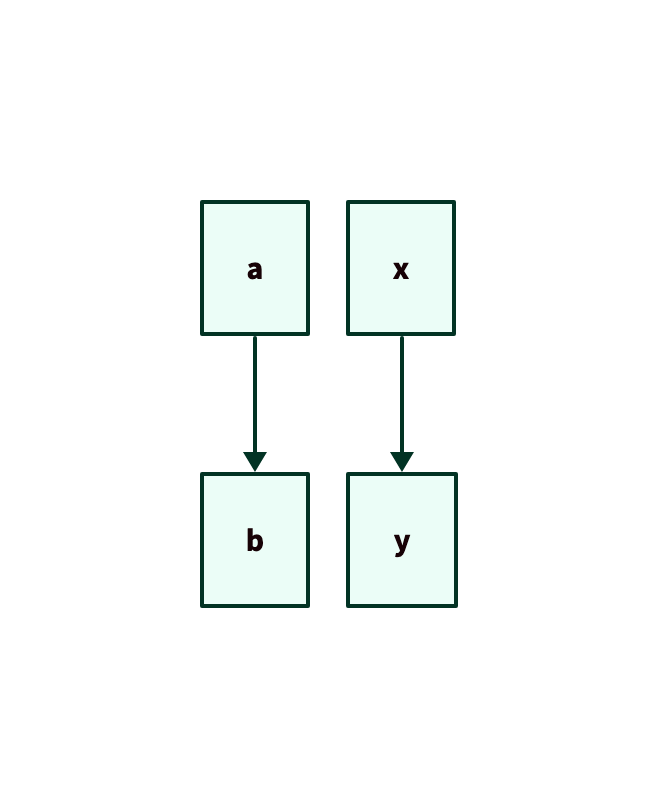

<!-- README.md is generated from README.Rmd. Please edit that file -->

# d2r

<!-- badges: start -->

[](https://lifecycle.r-lib.org/articles/stages.html#experimental)
[](https://opensource.org/licenses/MIT)
[](https://www.repostatus.org/#wip)
<!-- badges: end -->

The goal of d2r is to support the creation, reading, writing, and
rendering of D2 diagrams using R.

## Installation

You can install the development version of d2r like so:

``` r
# pak::pkg_install("elipousson/d2r")
```

## Example

``` r
library(d2r)
## basic example code
```

Example of basic diagram creation:

``` r
d2_diagram(c("a" = "b"))
#>        a 
#> "a -> b"
```

Example of diagram with specified connectors:

``` r
d2_diagram(
  c("x" = "y", "y" = "z"),
  connector = c("->", "<-")
)
#>        x        y 
#> "x -> y" "y <- z"
```

Example of rendered diagram:

``` r
withr::with_tempdir({
    diagram <- d2_diagram(c("a" = "b", "x" = "y"))  
    d2_write(diagram, "example.d2")
    
    d2_render("example.d2", "example.png", theme = "everglade green", intern = TRUE)
    
    magick::image_ggplot(magick::image_read("example.png"))
}) 
```


