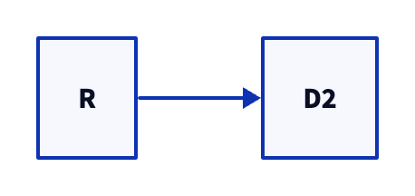
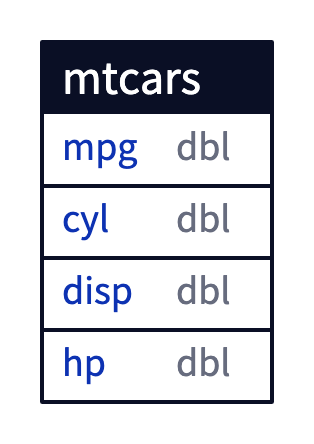
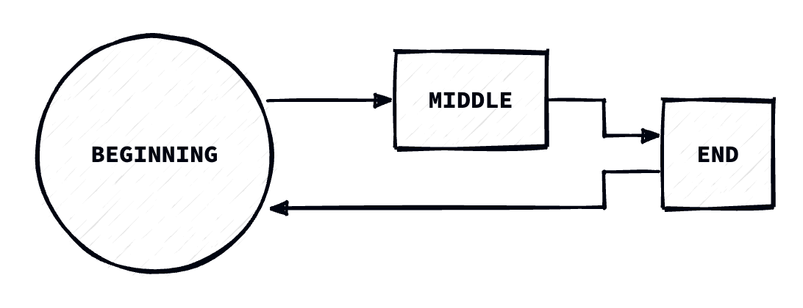

<!-- README.md is generated from README.Rmd. Please edit that file -->

# d2r

<!-- badges: start -->

[](https://lifecycle.r-lib.org/articles/stages.html#experimental)
[](https://opensource.org/licenses/MIT)
[](https://www.repostatus.org/#wip)
<!-- badges: end -->

The goal of d2r is to support the creation, reading, writing, and
rendering of D2 diagrams using R.

What is D2? From the [D2 Introduction](https://d2lang.com/tour/intro):

> D2 is a diagram scripting language that turns text to diagrams. It
> stands for Declarative Diagramming. Declarative, as in, you describe
> what you want diagrammed, it generates the image.

I am a contributor to the [D2 Extension for
Quarto](https://github.com/data-intuitive/quarto-d2) and created this
package to experiment with the possibilities of native R diagram
creation and rendering.

Note that this package is experimental and the process for building and
editing D2 diagrams is likely to change. I also hope to add a knitr
engine to support d2 code blocks within a RMarkdown or Quarto document.

## Installation

You can install the development version of d2r like so:

``` r
# pak::pkg_install("elipousson/d2r")
```

## Examples

### Setup

``` r
library(d2r)
```

If d2 is installed and available on your PATH, you can check the
version:

``` r
d2_version()
#> ℹ v0.7.0 <https://d2lang.com/releases/0.7.0>
```

If you have D2 installed with Homebrew, you may have trouble rendering a
diagram within a RMarkdown. If so, you may need to set an environmental
variable that points to the D2 PATH.

Use `d2_which()` to locate the path for the installed version of D2:

``` r
d2_which()
#> [1] "/opt/homebrew/bin/d2"
```

See this [2018 blog post by Tony
Tsai](https://blog.tonytsai.name/blog/2018-05-07-setting-path-variable-for-gs-command-in-rstudio/)
on trouble-shooting `PATH` variable issues for `brew`-installed
commands.

## Basic usage

``` r
# Helper function for file paths
fig_path <- \(x) {
  paste0(knitr::opts_chunk$get("fig.path"), x)
}

options(
  d2r.pad = 20,
  d2r.direction = "right"
)
```

Here is a basic example using `d2_diagram()` to create a basic diagram
with two connected shapes based on a named character vector:

``` r
simple_diagram <- d2_diagram(
  c("R" = "D2")
)

simple_diagram
#> [1] "direction: right" ""                 "R -> D2"
```

``` r
d2_include(
  simple_diagram,
  fig_path("simple_diagram.png")
)
```



You can pass both named and unnamed lines of text with D2 syntax,
specify connectors (used with the named elements), and set the overall
direction for the diagram:

``` r
connected_diagram <- d2_diagram(
  c("R" = "D2", "D2" = "R"),
  "R.shape: oval",
  "D2.shape: square",
  connector = "->"
)

connected_diagram
#> [1] "direction: right" ""                 "R -> D2"          "D2 -> R"         
#> [5] "R.shape: oval"    "D2.shape: square"
```

``` r
d2_include(
  connected_diagram,
  fig_path("connected_diagram.png")
)
```


The entity-relationship diagrams and table schema can be represented
using the SQL table style diagrams with `d2_sql_table()`:

``` r
mtcars_tbl <- d2_sql_table(mtcars[, 1:4], id = "mtcars")

mtcars_tbl
#> [1] "mtcars: {\n       label: mtcars\n     shape: sql_table\n        mpg: dbl\n\n    cyl: dbl\n\n    disp: dbl\n\n    hp: dbl\n\n}"

d2_include(mtcars_tbl, output = fig_path("mtcars.png"))
```



You can use `d2_render()` to convert a D2 file into a PNG, SVG, PDF, or
GIF file. `d2_include()` is a wrapper for `knitr::include_graphics()`
that helps to include a diagram in a Quarto or R Markdown document:

``` r
diagram <- d2_diagram(
  c(
    "Beginning" = "Middle",
    "Middle" = "End",
    "End" = "Beginning"
  ),
  "Beginning.shape: circle",
  "End.shape: square",
  direction = "right"
)

diagram
#> [1] "direction: right"        ""                       
#> [3] "Beginning -> Middle"     "Middle -> End"          
#> [5] "End -> Beginning"        "Beginning.shape: circle"
#> [7] "End.shape: square"

d2_include(
  diagram,
  output = fig_path("include-example.png"),
  sketch = TRUE,
  theme = "Terminal"
)
```



## Related packages and projects

Quarto extension for embedding d2 diagrams in documents:

- [quarto-d2](https://github.com/data-intuitive/quarto-d2)

ggplot2 packages for building diagrams and network visualizations:

- [ggdiagram](https://wjschne.github.io/ggdiagram/)
- [ggflowchart](https://nrennie.rbind.io/ggflowchart/)
- [ggraph](https://ggraph.data-imaginist.com/)
- [ggdag](https://r-causal.github.io/ggdag/)

Other network visualization packages:

- [DiagrammeR](https://rich-iannone.github.io/DiagrammeR/)
- [networkD3](https://christophergandrud.github.io/networkD3/)

Other packages for working with diagrams:

- [minixcali](https://baptiste.github.io/minixcali/index.html)

Find more diagram-focused packages and projects in [this GitHub
list](https://github.com/stars/elipousson/lists/r-diagrams).
